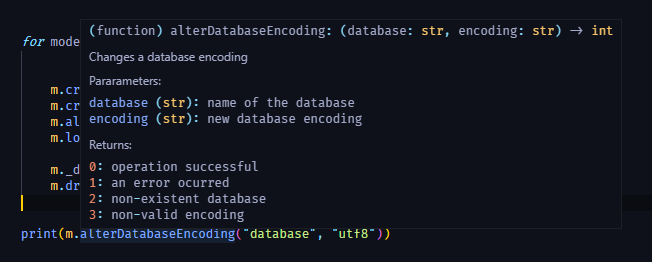

# Manual de Usuario

TytusStorage es una librería escrita en Python 3 que provee un gestor de almacenamiento para un administrador de bases de datos (DBMS).
TytusStorage almacena datos localmente utilizando hasta 7 modos de almacenamiento:

- Árbol AVL
- Árbol B
- Árbol B+
- Tabla Hash (de dispersión)
- ISAM
- Diccionarios
- JSON

TytusStorage está dotado de funciones de enlazamiento de datos, seguridad, graficación, entre otras, para otorgar una gran flexibilidad y comodidad de uso.

## Índice

- [Introduccion](#introduccion)
- [Glosario](#glosario)
- [FAQ](#faq)
- [Uso de la librería](#uso-de-la-librería)
- [Uso del almacenamiento](#uso-del-almacenamiento)
- [Uso del administrador del modo de almacenamiento](#uso-del-administrador-del-modo-de-almacenamiento)
- [Uso del administrador de índices](#uso-del-administrador-de-índices)
- [Uso del administrador de codificación](#uso-del-administrador-de-codificación)
- [Uso del generador de checksum](#uso-del-generador-de-checksum)
- [Uso del administrador de compresión de datos](#uso-del-administrador-de-compresión-de-datos)
- [Uso del administrador de seguridad](#uso-del-administrador-de-seguridad)
- [Uso del generador de diagramas de dependencias](#uso-del-generador-de-diagramas-de-dependencias)
- [Uso del reportador gráfico](#uso-del-reportador-gráfico)

## Introduccion 
TytusStorage es una libreria que busca proveera las funciones necesarias para ser un DBMS consistente, eficaz y con un excelente rendimiento.
Provee a los ususarios la forma de crear bases de datos con distintos modos de almacenamiento, dichos modos consisten cada uno en una estructura consistente diferente, el cual debe ser usado cada uno por su debidas carateristicas unicas, cada modo tiene ventajas y desventajas, las cuales el usuario puede explorar para saber explotarlas y usarlas a su favor, para una base pequeña con llaves primarias bien definidas y no consecutivas se puede usar un modo hash, el cual tiene un acceso rapido a sus datos y provee una optima consistencia, sin embargo para llaves continuas las tablas se vuleven cada vez mas grandes teniendo poco espacio utilizado, creando almacenamiento basura que no se puede eliminar. Es asi como cada modo nos provee de caracteristicas unicas y distintas, y esta libreria provee de 7 modos distintos.
Sin embargo la libreria no esta destinada solamente al almacenamiento, tambien provee de otras funciones que esperan ser explotadas por el ususario, si se piensa enviar una base de datos es posible comprobar su integridad por medio del checksum, provee funciones de encriptacion para cualquier cadena de texto, modo seguro para las tablas y opciones de compresion de datos.

## Glosario

| TERMINO   | DESCRIPCCION   |
| ----- | ----- |
| Archivo CSV | Los archivos CSV son un tipo de documento en formato abierto sencillo para representar datos en forma de tabla, en las que las columnas se separan por comas y las filas por saltos de línea. |
| Base de datos | Una base de datos es un conjunto de datos pertenecientes a un mismo contexto y almacenados sistemáticamente para su posterior uso. Es capaz de almacenar gran cantidad de datos, relacionados y estructurados, que pueden ser consultados rápidamente de acuerdo con las características selectivas que se deseen. |
| Eficiencia | Proporcionar un desempeño apropiado, en relación con la cantidad de recurso utilizado, bajo condiciones establecidas en determinado momento del tiempo. |
| Interfaz | La interfaz es el medio donde el usuario puede comunicarse con una maquina, equipo o dispositivo, y comprender los puntos de contacto entre el usuario y el equipo.  |
| Llave Foranea | Una llave foránea o llave ajena es una limitación referencial entre dos tablas e identifica una columna o grupo de columnas en una tabla que se refiere a una columna o grupo de columnas en otra tabla. |
| Llave Primaria | Una llave primaria es un campo o una combinacion de campos que identifica de forma unica a cada fila de una tabla |
| Parametro | Un parámetro, generalmente, es cualquier característica que pueda ayudar a definir o clasificar un sistema particular. |
| Python | Python es un lenguaje de programación interpretado cuya filosofía hace hincapié en la legibilidad de su código. Se trata de un lenguaje de programación multiparadigma, ya que soporta orientación a objetos, programación imperativa y, en menor medida, programación funcional. |
| Registro | Un registro representa un objeto único de datos implícitamente estructurados en una tabla. |
| Tabla Hash | Una tabla hash es una estructura asosiada a llaves o claves con valores. La operación principal que soporta de manera eficiente es la búsqueda: permite el acceso a los elementos almacenados a partir de una clave generada. |
| Tupla | Una tupla es una lista ordenada finata de elementos (componentes).|

## FAQ

1. ¿PREGUNTA?

> **Respuesta:** RESPUESTA.


## Uso de la librería

Para ejecutar la librería es necesario tener instalado Python 3 para [Windows](https://www.python.org/downloads/windows/) o para [Linux](https://www.python.org/downloads/source/).

TytusStorage se puede incorporar en un proyecto con la siguiente línea de código:

```sh
from storage import TytusStorage
```

Se puede acceder al repertorio de funciones posteriormente descritas de la siguiente manera:

```sh
TytusStorage.createDatabase("new_database", "hash", "ascii")
TytusStorage.showDatabases()
TytusStorage.checksumDatabase("new_database", "MD5")
...
```

Conviene consultar el DOCSTRING de la función de interes, así como imprimir su resultado:



```sh
creation = createDatabase("database", "hash", "utf8")
encoding = alterDatabaseEncoding("database", "utf8")
print(creation, ',', encoding)
```

> 0 , 3

TytusStorage almacena todo dentro de la carpeta *data* del proyecto, de manera recurrente y eficaz.


## Uso del almacenamiento

Las siguientes funciones se enfocan en 

### funci(param, param) 
explicacion

| Valor de retorno | Definición |
| ------ | ------ |
| 0 | Operación exitosa |
| 1 | Error en la operación |
| 2 | Base de datos inexistente |
| 3 | Tabla inexistente |


## Uso del administrador del modo de almacenamiento

Las siguientes funciones se enfocan en 

### funci(param, param) 
explicacion

| Valor de retorno | Definición |
| ------ | ------ |
| 0 | Operación exitosa |
| 1 | Error en la operación |
| 2 | Base de datos inexistente |
| 3 | Tabla inexistente |


## Uso del administrador de índices

Las siguientes funciones se enfocan en 

### funci(param, param) 
explicacion

| Valor de retorno | Definición |
| ------ | ------ |
| 0 | Operación exitosa |
| 1 | Error en la operación |
| 2 | Base de datos inexistente |
| 3 | Tabla inexistente |


## Uso del administrador de codificación

Las siguientes funciones se enfocan en 

### funci(param, param) 
explicacion

| Valor de retorno | Definición |
| ------ | ------ |
| 0 | Operación exitosa |
| 1 | Error en la operación |
| 2 | Base de datos inexistente |
| 3 | Tabla inexistente |


## Uso del generador de checksum

Las siguientes funciones se enfocan en 

### funci(param, param) 
explicacion

| Valor de retorno | Definición |
| ------ | ------ |
| 0 | Operación exitosa |
| 1 | Error en la operación |
| 2 | Base de datos inexistente |
| 3 | Tabla inexistente |


## Uso del administrador de compresión de datos

Las siguientes funciones se enfocan en 

### funci(param, param) 
explicacion

| Valor de retorno | Definición |
| ------ | ------ |
| 0 | Operación exitosa |
| 1 | Error en la operación |
| 2 | Base de datos inexistente |
| 3 | Tabla inexistente |


## Uso del administrador de seguridad
El administrador de seguridad hace uso de la libreria cryptography para su funcionamiento, para instalar la libreria es necesario ejecutar el siguiente comando:
```sh
pip install cryptography
```
Si desea obtener mas informacion sobre esta libreria, puede consultar su documentacion [aqui-](https://pypi.org/project/cryptography/ "Documentacion Cryptography")

Las siguientes funciones se enfocan en efectos de seguridad bajo conceptos de criptografia y blockchain, se trata de dos secciones, con los nombres de los conceptos antes mencionados, cada una de las secciones cuenta cada una con dos funciones, las cuales se detallaran a continucaion, sin embargo se puede mencionar como sun funcion principal la encriptacion y desncriptacion de cadenas de texto, y el manejo de tablas seguras, las cuales proveen al usuario una forma de almacenar sus datos y verificar que estos sigan intactos.

### Funciones de Criptografia

### encrypt(backup, password) 
La funcion encrypt es la encargada de encriptar un texto, con la contraseña que se le pasa como parametro, dicha funcion devuelve el texto encriptado como una cadena de texto (string).
Parametros:
- backup: Es el string que se desea encriptar
- password: Cadena que se usara para la encriptacion del texto, es importante si luego se desea desencriptar el texto, pues para lograrlo sera necesaria la misma contraseña

| Valor de retorno | Definición |
| ------ | ------ |
| Cadena | Cadena encriptada |
| 1 | Error en la operación |

### decrypt(cipherbackup, password) 
La funcion decrypt es la encargada de desencriptar la cadena que se le haya pasado, con la contraseña que se le pasa como parametro, dicha funcion devuelve el texto desencriptado como una cadena de texto (string).
Parametros:
- cipherbackup: Es el string que se desea desencriptar
- password: Cadena que se usara para la desencriptacion del texto, si no es la correcta el metodo fallara

| Valor de retorno | Definición |
| ------ | ------ |
| Cadena | Cadena desencriptada |
| 1 | Error en la operación |

### Funciones de BlockChain

### SafeModeOn(database, table) 
Activa el modo seguro para una tabla en especifico, a partir de la activacion del modo seguro cualquier insert a la tabla sera guardado utilizando la tecnica BlockChain, y cualquier update de los datos insertados dañara la consistencia de los datos.
Parametros:
- database: Nombre de la base de datos a la que pertenece la tabla que estara en modo seguro
- table: Nombre de la tabla a la cual sera activado el modo seguro 

| Valor de retorno | Definición |
| ------ | ------ |
| 0 | Operacion exitosa |
| 1 | Error en la operación |
| 2 | Base de datos inexistente |
| 3 | Tabla inexistente |
| 4 | Modo seguro existente |

### SafeModeOff(database, table) 
Desactiva el modo seguro para una tabla en especifico, los inserts y updates volveran a actuar con normalidad, y el blockchain anterior sera eliminado.
Parametros:
- database: Nombre de la base de datos a la que pertenece la tabla 
- table: Nombre de la tabla a la cual se le desactivara el modo seguro 

| Valor de retorno | Definición |
| ------ | ------ |
| 0 | Operacion exitosa |
| 1 | Error en la operación |
| 2 | Base de datos inexistente |
| 3 | Tabla inexistente |
| 4 | Modo seguro inexistente |

### GraphSafeTable(database, table) 
Grafica el los bloques de BlockChain de una tabla en modo seguro.
Parametros:
- database: Nombre de la base de datos a la que pertenece la tabla 
- table: Nombre de la tabla a la cual se desea graficar }

| Valor de retorno | Definición |
| ------ | ------ |
| Imagen | Grafo de los bloques |


## Uso del generador de diagramas de dependencias

Las siguientes funciones se enfocan en 

### funci(param, param) 
explicacion

| Valor de retorno | Definición |
| ------ | ------ |
| 0 | Operación exitosa |
| 1 | Error en la operación |
| 2 | Base de datos inexistente |
| 3 | Tabla inexistente |


## Uso del reportador gráfico

Las siguientes funciones se enfocan en 

### funci(param, param) 
explicacion

| Valor de retorno | Definición |
| ------ | ------ |
| 0 | Operación exitosa |
| 1 | Error en la operación |
| 2 | Base de datos inexistente |
| 3 | Tabla inexistente |
