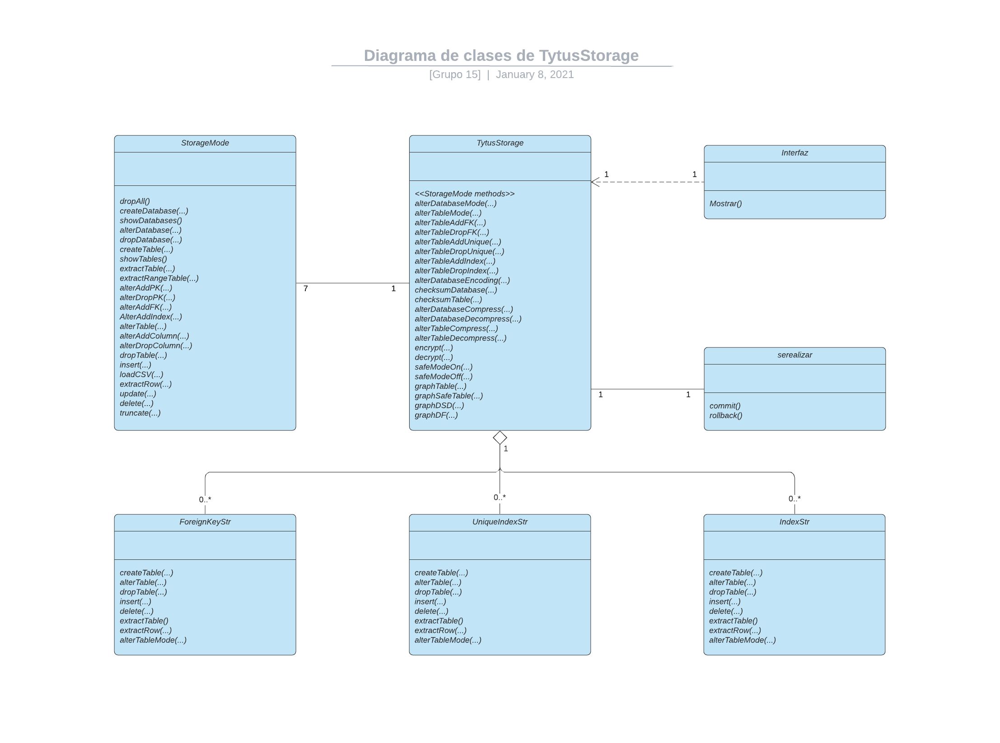
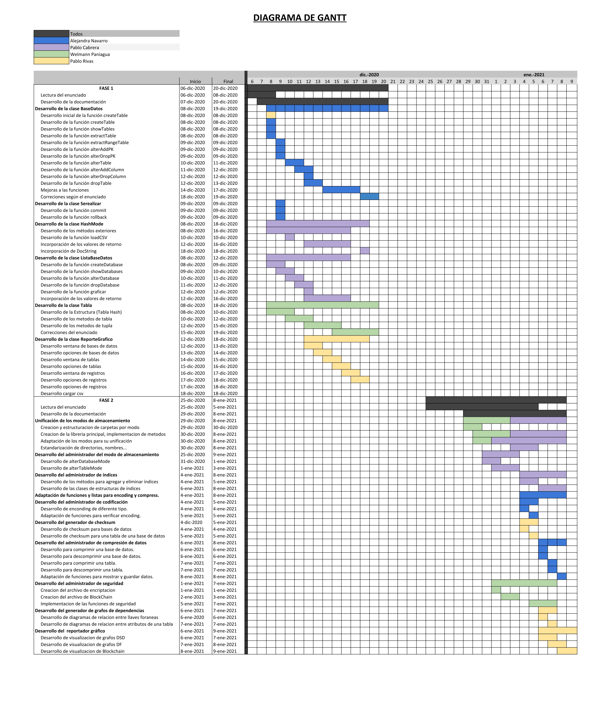

# Manual Técnico

## Índice

- [Introducción](#introducción)
- [Objetivos](#objetivos)
- [Alcances del proyecto](#alcances-del-proyecto)
- [Requerimentos funcionales](#requerimentos-funcionales)
- [Atributos del sistema](#atributos-del-sistema)
- [Administrador de almacenamiento](#administrador-de-almacenamiento)
- [Administrador del modo de almacenamiento](#administrador-del-modo-de-almacenamiento)
- [Administrador de índices](#administrador-de-índices)
- [Administrador de codificación](#administrador-de-codificación)
- [Generador de checksum](#generador-de-checksum)
- [Administrador de compresión de datos](#administrador-de-compresión-de-datos)
- [Administrador de seguridad](#administrador-de-seguridad)
- [Generador de diagramas de dependencias](#generador-de-diagramas-de-dependencias)
- [Repotrador gráfico](#reportador-grafico)
- [Diagrama de clases](#diagrama-de-clases)
- [Diagrama de Gantt](#diagrama-de-gantt)

## Introducción
TytusStorage busca ser una libreria capaz de proveer las funciones necesarias para ser usada como un DBMS, dicha libreria sera utilizada por los estudiantes del curso de Organizacion y Lenguajes de Compiladores 2 (Estudiantes con los cuales se esta trabajando en conjunto), para construir un lenguaje basado en SQL, que consumira las funciones de esta libreria.

La libreria pretende contar con todas las funciones de un DBMS como MySQL o PostgreSQL, entre ellas funciones de criptografia, encoding y hasta compresion de datos. 

Este manual pretende dar una explicacion del desarrollo de la libreria, para que cualquier desarrollador con conocimientos en estructuras y bases de datos pueda retomar el proyecto y fortalecer las debilidades que puedan ser evidenciadas en este.

## Objetivos

### General

obj

### Específicos

- obj
- obj
- obj

## Alcances del proyecto

Este proyecto es la segunda fase de un proyecto de nombre HashMode, el cual se puede revisar su documentacion [aqui.](https://github.com/tytusdb/tytus/blob/main/storage/team15/docs/Manual%20tecnico.md) Como se puede observar en la primera fase de este proyecto se desarrollo la estuctura para el almacenamiento interno de un DBMS, buscando crear las funciones necesarias para poder crear un administrador de bases de datos funcional y eficaz, en dicha fase la estructura utilizada fue una tabla hash, por las ventajas ahi descritas. Sin embargo, ese proyecto solo fue una de las partes que constituiran esta segunda fase, el proyecto fue construido en conjunto a otros compañeros del curso Estructuras de Datos, el objetivo de otros grupos era la construccion del mismo administrador pero con estructuras de datos distintas, arbol b, arbol b+, AVL, json, diccionarios e isam.

Esta segunda fase consiste en la unificacion de todos los modos de almacenamiento en una sola libreria universal, la cual tendra las mismas funciones que cada una de las librerias individuales y ciertos agregados extra, esta libreria hace posible la eleccion del modo de almacenamineto a utilizar en la creacion de las bases de datos, asi como tambien permite cambiar de modo una tabla en especifico, ademas de esta posibilidad, la libreria permite tambien la eleccion del encoding a utilizar, teniendo entre sus opciones ascii, iso-8859-1 y utf-8.

Adicionalmente, la libreria provee de una forma de compresion de datos, con la cual segun el modo elegido es posible la reduccion del espacio que una tabla o base de datos ocupa en nuestra computadora, siendo esto de gran beneficio para el almacenamiento de las bases de datos, dandonos un almacenaminto mas ligero y efectivo.

En caso del envio de datos, se provee de una funcion de cheksum, la cual permite verificar la integridad de los datos enviados, asi mismo, la libreria cuenta con funciones de seguridad especificamente de criptografia y una forma de monitorear la integridad de los datos por medio de blockchain, este metodo se conoce como Tablas Seguras, lo cual consiste en un modo en el cual cada nuevo insert constituye un bloque de BLockChain, y un update de uno de los nuevos datos representa la perdida de la integridad de los datos, lo cual indica que la tabla fue modificada. 

## Requerimentos funcionales

- req
- req
- req

## Atributos del sistema

- at
- at
- at

## Administrador de almacenamiento

cuerpo

## Administrador del modo de almacenamiento

cuerpo

## Administrador de índices

cuerpo

## Administrador de codificación

cuerpo

## Generador de checksum

cuerpo

## Administrador de compresión de datos

cuerpo

## Administrador de seguridad

El administrador de seguridad es una parte de la libreria que se encarga, como su nombre lo inidica, de proporcionar metodos de seguridad en base a criptografia y BlockChain.

Para estos metodos se manejaron dos archivos py extras que se utilizan como librerias, para tener en la libreria principal un codigo mas sencillo y legible, en el cual solo se invocan las funciones de las librerias creadas, los archivos py utilizados fueron llamadas BlockChain y compresion, dichos archivos estan alojados en la carpeta /misc, en ella se puede visualizar dichos archivos para poder examinar los metodos codificados, a continuacion se explican mas a detalle estos archivos.

### Archivo compresion
Para el archivo de compresion se hizo uso de la libreria cryptography proveida por python, dicha libreria no es nativa, por lo cual se debe instalar, para instalarla y hacer uso de sus metodos se requiere ejecutar el siguiente comando:

```sh
pip install cryptography
```
Si requiere una explicacion mas detallada de la libreria *cryptography* puede consultarla [aqui.](https://pypi.org/project/cryptography/ "Documentacion Cryptography")

Con esta libreria la encriptacion y desencriptacion es bastante sencilla, se invoca un objeto fernet, de la libreria cryptography, pasandole la llave con la que se hara la encriptacion o desencriptacion, para luego invocar el metodo encrypt o decrypt respectivamente.

El metodo que involucra algo mas conplejo es la generacion de la llave en base a la password que se brinda, pues fernet lo hace de manera aleatoria, se hizo uso de la misma libreria cryptography pero utilizando sus sublibrerias, para lograrlo se requiere de las siguientes importaciones:

`
from cryptography.hazmat.primitives import hashes
`

`
from cryptography.hazmat.backends import default_backend
`

`
from cryptography.hazmat.primitives.kdf.pbkdf2 import PBKDF2HMAC
`


Con estos imports el metodo que genera la llave es bastante sencillo, siendo el siguiente, donde _nombre_ es la contraseña con la que se hara la encriptacion:
```sh
      kript = PBKDF2HMAC(hashes.SHA256(), 32, b'team15', 100, default_backend())
      key = base64.urlsafe_b64encode(kript.derive(nombre.encode()))
```

De esta manera se generan los metodos de encriptacion y desencriptacion, siendo los siguientes:
```sh
    def encriptar(mensaje, llave):
        f = Fernet(GenerarLlave(llave))
        byteMessage = mensaje.encode()
        return f.encrypt(byteMessage).decode()

    def desencriptar(mensaje, llave):
        f = Fernet(GenerarLlave(llave))
        return f.decrypt(mensaje.encode()).decode()
```
Dichos metodos son solo llamados en la libreria principal, haciendo una importacion de compresion y nombrandola como *comp*, acomodandolos en un try por cualquier error, el codigo en la libreria principal queda implementado de la siguient manera:

```sh
    try:
        return comp.encriptar(backup, password)
    except:
        return '1'
```

### Archivo BlockChain
El blockchain se utiliza como un metodo para proporcionar tablas seguras, es decir todo insert que se hace mientras el modo esta activo se almacena en bloques, que generan un hash con los datos ingresados y guardan el hash anterior, esto genera una cadena consistente en la cual se puede comprobar que los datos no hallan cambiado, en caso se haga un update el hash del bloque cambiara, pero el atributo anterior de el siguiente bloque no, lo cual creara una inconsistencia con lo cual se comprobara que la tabla fue modificada.

Al igual que con el archivo compresion todas las funciones se crearon desde aqui para solo ser invocadas en la libreria principal.

El hash de los datos es generado usando la libreria *hashlib*, dicha libreria es nativa, por lo cual no es necesaria ninguna instalacion, la funcion para generar el hash de los datos es la siguiente:
```sh
def GenerarHash(cadena):
    return hashlib.sha256(cadena.encode()).hexdigest(
```

Al activar el modo seguro se crea el archivo json de la tabla como *data/SafeTable/nombreTabla.json*, esto se usa para la comprobacion de si una tabla tiene modo seguro, la comprobacion es sencilla, solo se comprueba si existe un json con el nombre de la tabla de la siguiente manera:
```sh
def EsUnaTablaSegura(nombreTabla, ruta):
    ruta = ruta + "\\SafeTables\\" + str(nombreTabla) + ".json"
    return os.path.isfile(ruta)
```

Esta comprobacion es util para saber si una tabla esta en modo seguro, esto se comprueba en los inserts y los updates de la libreria principal, si el insert fue exitoso y la tabla esta en modo seguro se debe llamar al metodo *InsertSafeTable* de la libreria BlockChain, el metodo recibe el nombre de la tabla y los datos a ingresar, busca el archivo json por medio de la ruta y el nombre de la tabla, lo lee y recupera la lista de bloques, esto lo hace para ingresar el nuevo bloque y volver a escribir el archivo, el metodo es el siguiente:
```sh
def insertSafeTable(nombreTabla, datos, ruta):
    cadena = ''
    contador = 0
    ruta = ruta + "\\SafeTables\\" + str(nombreTabla) + ".json"

    for dato in datos:
        if contador == len(datos) - 1:
            cadena += str(dato)
        else:
            cadena += (str(dato) + ',')
        contador += 1

    file = open(ruta, "r")
    lista = js.loads(file.read())
    file.close()

    id = len(lista)
    h = GenerarHash(cadena)
    if id == 1 and lista[0] == 'inicio':
        DatosBloque = [0, cadena, '000000000000000000', h]
        lista.pop()
    else:
        id -= 1
        DatosBloque = [id, cadena, lista[id-1][3], h]
        lista.pop()
    lista.append(DatosBloque)
    lista.append([45612, 'datofinalParaComprobacionFinal', h, h])
    file = open(ruta, "w+")
    file.write(js.dumps(lista))
    file.close()
```

La misma logica funciona con los updates, si la tabla esta en modo seguro se debe extraer la tupla sin modificacion primero, si el update fue exitoso se debe hacer otro extractRow pero con los datos ya modificados, de esta manera recuperamos los datos necesarios para invocar el metodo update de BlockChain para cambiar el hash del dato modificado, el update de la libreria es el siguiente:
```sh
def updateSafeTable(nombreTabla, datos, datosmodificados, ruta):
    cadena = ''
    cadenaModificcada = ''
    contador = 0
    ruta = ruta + "\\SafeTables\\" + str(nombreTabla) + ".json"

    for dato in datos:
        if contador == len(datos) - 1:
            cadena += str(dato)
        else:
            cadena += (str(dato) + ',')
        contador += 1
    contador = 0

    for dato in datosmodificados:
        if contador == len(datos) - 1:
            cadenaModificcada += str(dato)
        else:
            cadenaModificcada += (str(dato) + ',')
        contador += 1

    file = open(ruta, "r")
    lista = js.loads(file.read())
    file.close()

    for bloque in lista:
        if cadena == bloque[1]:
            bloque[1] = cadenaModificcada
            bloque[3] = GenerarHash(cadenaModificcada)
            file = open(ruta, "w+")
            file.write(js.dumps(lista))
            file.close()
            return True
```

Para graficar estos bloques se hace uso de graphviz, con una funcion que genera el dot y luego lo convierte a imagen.

Como ya se menciono los metodos solo se llaman en la libreria principal, importando BlockChain con el nombre BC, los metodos se ven de la siguiente manera, haciendo las comprobaciones necesarias de existencia de bases de datos y tablas.
```sh
def safeModeOn(database: str, table: str) -> int:
    nombreST = str(database) + '-' + str(table)
    if not _database(database):
        return 2

    if not _table(database, table):
        return 3

    if BC.EsUnaTablaSegura(nombreST, _main_path):
        return 4

    try:
        BC.CreateBlockChain(nombreST, _main_path)
        return 0
    except:
        return 1
```

## Generador de diagramas de dependencias

cuerpo

## Reportador gráfico

cuerpo

## Diagrama de clases



## Diagrama de Gantt


